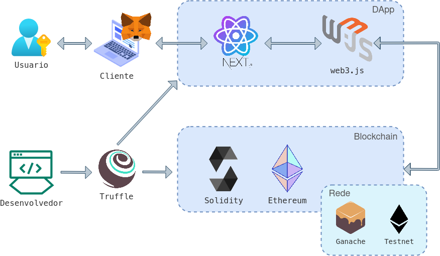
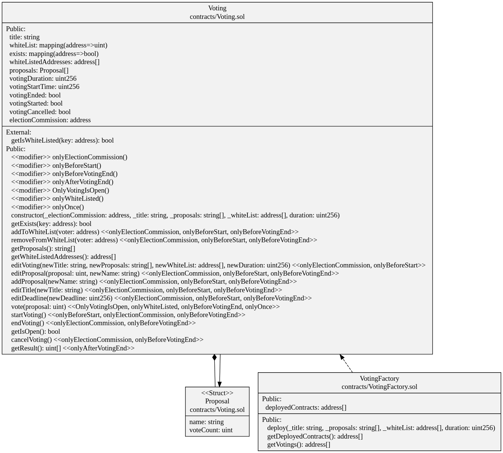
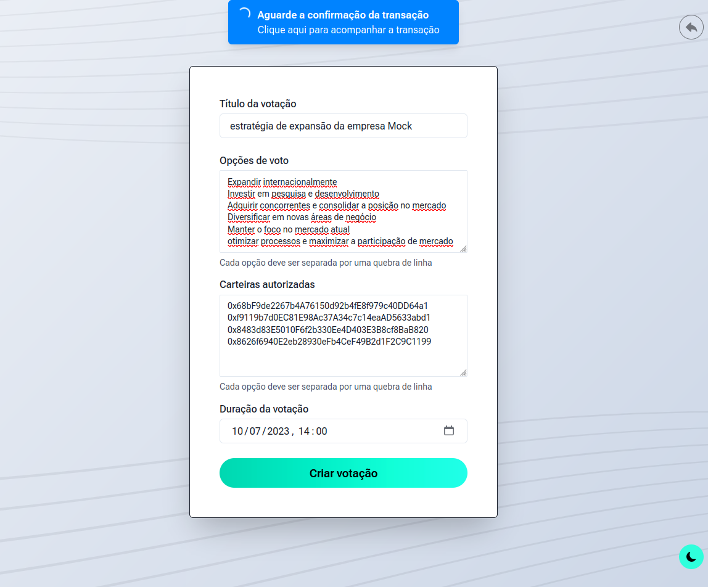
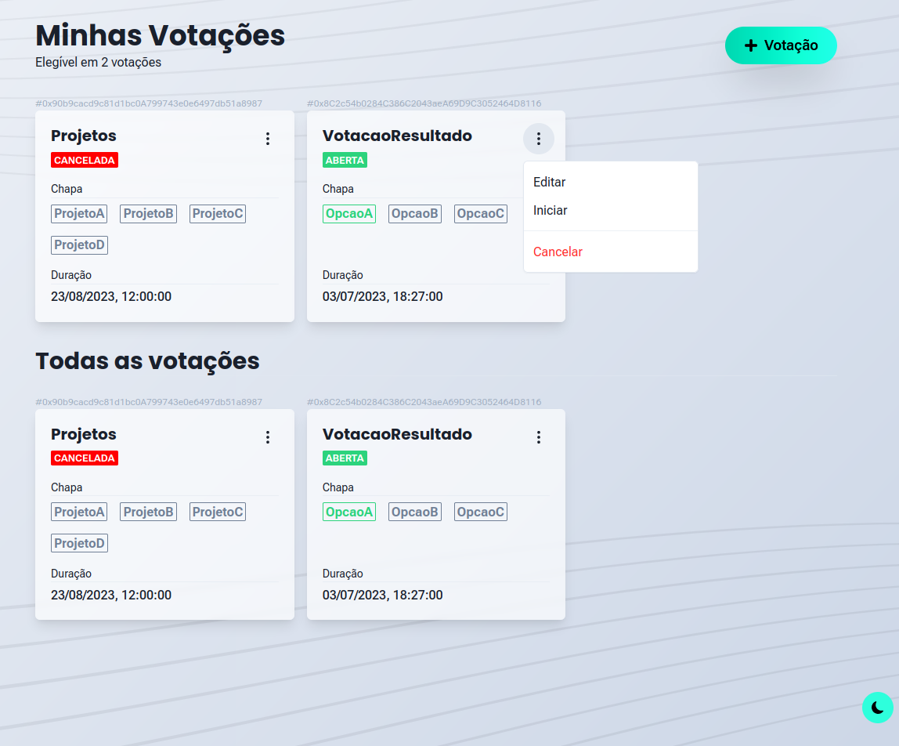
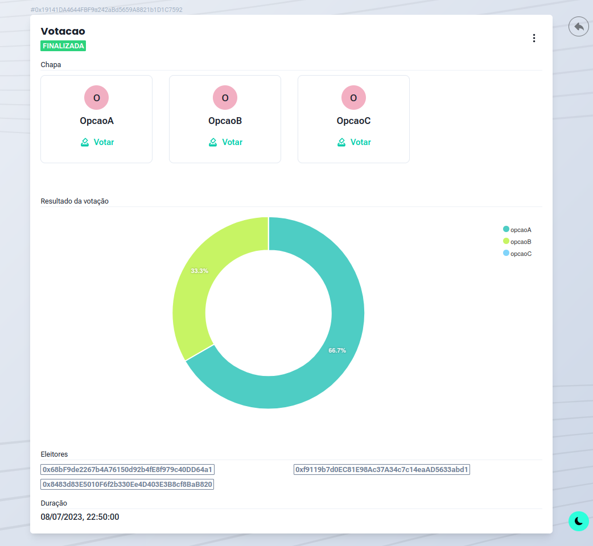
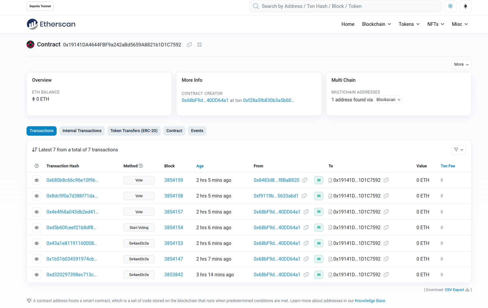

# TCC_blockchain_voting

# Abstract

Blockchain technology, which originated as a solution for financial transactions with Bitcoin, has been highlighted in several software applications. By using smart contracts on the Ethereum blockchain, it is possible to establish business rules and apply them in different sectors, including voting systems. In this work, a decentralized application (DApp) was developed that uses Ethereum technology to guarantee security, transparency, and integrity in the process of an open vote. The methodology adopted included bibliographical research for theoretical basis, data collection and the use of the Scrum framework and the agile Kanban methodology for technological development. An analysis of the advantages and challenges of using Ethereum blockchain technology in this specific context is carried out, identifying its positive contributions and limitations. The developed application provides users with the ability to audit their votes, ensuring that they are stored immutably.

Key-words: blockchain, smart contracts, Ethereum, voting, decentralized application,
DApp.

# DApp

## Smart Contracts

The solution implements two smart contracts: "Voting.sol" and "VotingFactory.sol". The "Voting.sol" contract enables the management of a voting process through a secure and transparent system, where only authorized addresses can vote. It records the voting proposals, allows relevant information to be modified, such as the title and deadline, and provides mechanisms to control the voting process, ensuring the integrity and verifiability of the votes. The contract includes functionalities to add and remove addresses from the whitelist, obtain the list of voting proposals, get the list of permitted addresses, edit proposals, edit the title and deadline of the voting, cast votes, initiate and finalize the voting, cancel the voting, and obtain the results. The "Voting" contract was tested through unit tests covering different aspects of its functionality (see Appendix \ref{lst:test-voting}).

On the other hand, "VotingFactory" is responsible for creating and managing voting contracts. The contract allows new voting contracts to be created and keeps a record of the created contracts. Additionally, it provides a function to retrieve the voting contracts in which a specific address is authorized to vote.

## Authentication

## Create Voting

## Voting List

## Result

## Etherscan
Through etherscan it is possible to verify the transactions carried out on the Ethereum network.

